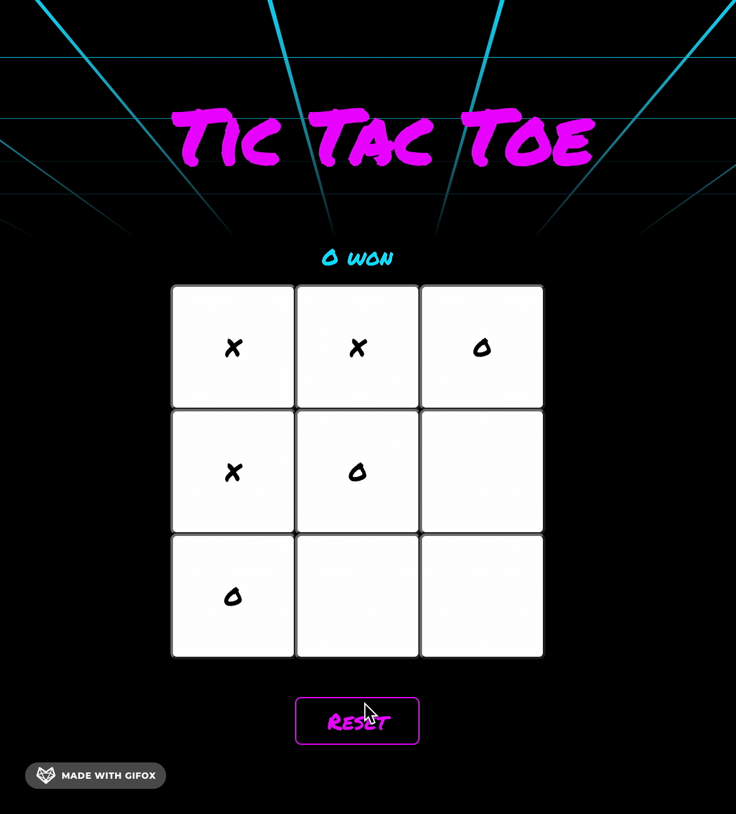

# Tic Tac Toe

## Synopsis

The famous Tic Tac Toe Game! You can try it at [https://franck093.github.io/tictactoe/](https://franck093.github.io/tictactoe/)

## How To

To start the app, first run `npm install` and then `npm start`. A new window will open on [http://localhost:3000](http://localhost:3000).

## Technologies

I coded this project with ReactJS.

The Tic Tac Toe game is a popular project to start with ReactJS. Here, I chose to code my project by only making use of function components.

This project was created through [https://github.com/facebook/create-react-app](Create-React-App).

## Design

I was inspired by the design of the video game Hotline Miami to create this retro design.
